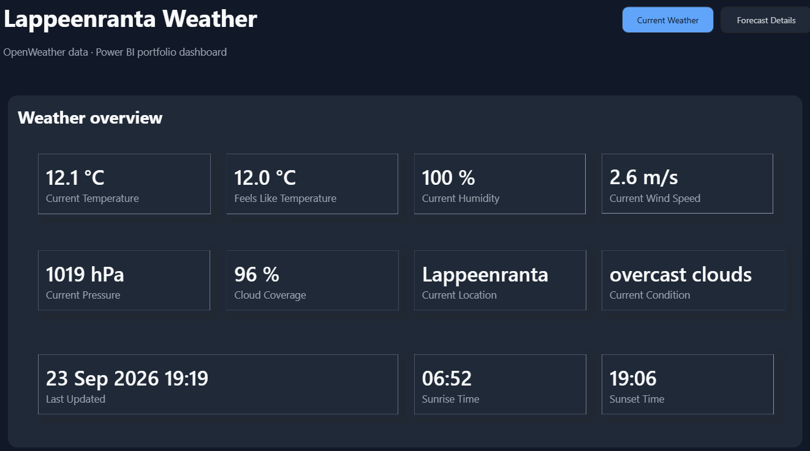
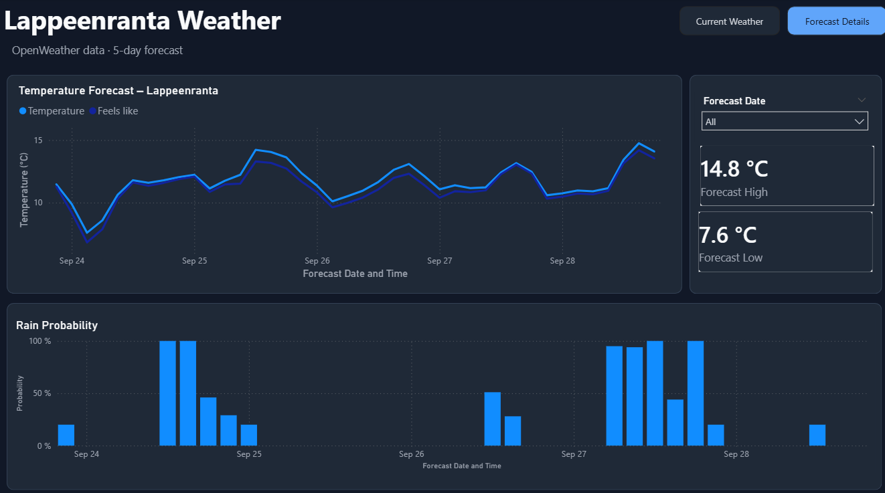

# Lappeenranta-Weather-Dashboard
A Power BI weather dashboard using the OpenWeather API to visualize current conditions and a 5-day forecast for Lappeenranta, Finland.

## Dashboard Preview
### Current weather

### Forecast Details


## Project Purpose and Learning Objectives
The main purpose of this project was to practise retrieving data from a web API and securely sharing an API-connected Power BI dashboard without exposing private API credentials.
The project covers the complete data workflow:
- Connecting Power BI to the OpenWeather API
- Retrieving current weather and forecast data in JSON format
- Cleaning and transforming the API data using Power Query
- Organizing the transformed data into a clear and useful structure
- Creating understandable cards, charts, slicers, and page navigation
- Managing the API key separately through Power BI's Web API credential system
- Exporting a secure `.pbit` template that can be shared publicly without including the API key or imported data

Through this project, I mainly practised API integration, JSON data transformation, Power Query, dashboard design, and secure credential management.

## Data Source
Weather data is retrieved from the [OpenWeather API](https://openweathermap.org/api) using:
- Current Weather Data API
- 5 Day / 3 Hour Forecast API
The dashboard is currently configured for Lappeenranta, Finland:
```text
Latitude: 61.05
Longitude: 28.19
Units: Metric
```

## Tools and Technologies
- Microsoft Power BI Desktop
- Power Query and M language
- OpenWeather REST API
- JSON data transformation
- Git and GitHub

## API Security
No API key or authentication credential is included in this repository.

The `.pbit` template contains the dashboard design, data model, Power Query transformations, and API query definitions. It does not include imported weather data or locally stored Web API credentials. Each user must provide their own OpenWeather API key when opening the template.

## Future Improvements
Possible future improvements include:
- Improving the design with weather icons, conditional colours, enhanced tooltips, and a mobile-friendly layout
- Publishing the report to Power BI Service and configuring scheduled data refresh
- Expanding coverage from Lappeenranta to cities across Finland
- Adding a city or location selector
- Adding an interactive map for comparing weather conditions across Finland
- Storing historical weather data for temperature, rainfall, and seasonal trend analysis
- Comparing current conditions with previous days, months, or years
- Adding weather warnings and highlighting unusual conditions
- Improving error handling for missing credentials, API failures, and unavailable data
- Adding Finnish and English language options
- Creating additional indicators such as daily average temperature, maximum wind speed, and total precipitation
- Developing a separate automated version with a cloud-based data pipeline or database
- Optimizing API requests to reduce unnecessary calls and stay within API usage limits

These improvements could gradually turn the current learning project into a more complete and scalable weather analytics solution.
